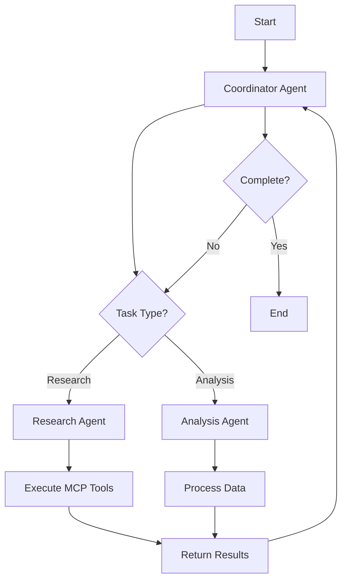

# Design Document: DeepAgents LangChain Sample Project

## Overview

This project demonstrates the comprehensive capabilities of DeepAgents with LangChain v1+, including middleware usage, subagent orchestration with LangGraph, and MCP tool integration. The project will be structured as a Python package managed by uv, containing multiple example scripts that showcase different aspects of DeepAgents functionality.

## Architecture

### Project Structure

```
deepagents-sample/
├── pyproject.toml           # uv project configuration
├── README.md                # Setup and usage instructions
├── src/
│   └── deepagents_sample/
│       ├── __init__.py
│       ├── middleware/
│       │   ├── __init__.py
│       │   ├── logging_middleware.py
│       │   └── metrics_middleware.py
│       ├── tools/
│       │   ├── __init__.py
│       │   ├── mcp_base.py
│       │   ├── command_tool.py
│       │   └── json_search_tool.py
│       ├── agents/
│       │   ├── __init__.py
│       │   ├── coordinator_agent.py
│       │   ├── research_agent.py
│       │   └── analysis_agent.py
│       └── examples/
│           ├── __init__.py
│           ├── example1_basic_middleware.py
│           ├── example2_langgraph_subagents.py
│           ├── example3_mcp_tools.py
│           └── run_all.py
└── data/
    └── sample.json          # Sample JSON data for jq tool
```

### Technology Stack

- **Python**: 3.10+
- **uv**: Package management and dependency resolution
- **LangChain**: v1.0+ (core framework)
- **LangGraph**: State machine and workflow orchestration
- **DeepAgents**: Multi-agent system framework from LangChain
- **MCP**: Model Context Protocol for tool integration

## Components and Interfaces

### 1. Middleware Components

#### LoggingMiddleware
```python
class LoggingMiddleware:
    """Logs all agent requests and responses"""
    
    def process_request(self, request: AgentRequest) -> AgentRequest:
        """Log and optionally modify incoming requests"""
        
    def process_response(self, response: AgentResponse) -> AgentResponse:
        """Log and optionally modify outgoing responses"""
```

#### MetricsMiddleware
```python
class MetricsMiddleware:
    """Tracks agent performance metrics"""
    
    def process_request(self, request: AgentRequest) -> AgentRequest:
        """Start timing and track request metrics"""
        
    def process_response(self, response: AgentResponse) -> AgentResponse:
        """Calculate duration and log metrics"""
```

### 2. MCP Tool Wrappers

#### CommandTool
```python
class CommandTool(MCPTool):
    """Executes command-line commands safely"""
    
    name: str = "execute_command"
    description: str = "Execute shell commands"
    
    def _run(self, command: str, timeout: int = 30) -> str:
        """Execute command with timeout and safety checks"""
```

#### JSONSearchTool
```python
class JSONSearchTool(MCPTool):
    """Search JSON files using jq queries"""
    
    name: str = "search_json"
    description: str = "Search JSON files using jq syntax"
    
    def _run(self, file_path: str, jq_query: str) -> str:
        """Execute jq query on JSON file"""
```

### 3. Agent Implementations

#### CoordinatorAgent
- **Role**: Main orchestrator that delegates tasks to subagents
- **Capabilities**: Task decomposition, delegation, result aggregation
- **Middleware**: Uses both logging and metrics middleware

#### ResearchAgent
- **Role**: Gathers information using MCP tools
- **Capabilities**: Command execution, JSON data extraction
- **Tools**: CommandTool, JSONSearchTool

#### AnalysisAgent
- **Role**: Processes and analyzes gathered information
- **Capabilities**: Data analysis, summary generation
- **Tools**: JSONSearchTool

### 4. LangGraph Workflow



## Data Models

### AgentState
```python
class AgentState(TypedDict):
    """State shared across LangGraph workflow"""
    messages: List[BaseMessage]
    current_task: str
    results: Dict[str, Any]
    agent_history: List[str]
    error: Optional[str]
```

### MCPToolRequest
```python
class MCPToolRequest(BaseModel):
    """Request format for MCP tools"""
    tool_name: str
    parameters: Dict[str, Any]
    timeout: int = 30
```

### MCPToolResponse
```python
class MCPToolResponse(BaseModel):
    """Response format from MCP tools"""
    success: bool
    result: Any
    error: Optional[str]
    execution_time: float
```

## Example Scenarios

### Example 1: Basic Middleware Usage
Demonstrates how middleware intercepts and processes agent communications:
- Create a simple agent with logging middleware
- Show request/response interception
- Display middleware execution order

### Example 2: LangGraph with Subagents
Shows hierarchical agent structure with state management:
- Coordinator delegates tasks to research and analysis agents
- State transitions through LangGraph workflow
- Subagent communication and result aggregation

### Example 3: MCP Tool Integration
Demonstrates external tool usage through MCP:
- Research agent uses CommandTool to execute system commands
- Analysis agent uses JSONSearchTool to query data
- Show tool registration and invocation patterns

## Error Handling

### Middleware Error Handling
- Middleware failures should not break agent execution
- Log errors and continue with original request/response
- Provide fallback behavior for critical middleware

### Tool Execution Error Handling
- Timeout handling for long-running commands
- Safe command execution with sandboxing
- Graceful degradation when tools fail

### Agent Error Handling
- Retry logic for transient failures
- Error propagation through LangGraph state
- Recovery strategies for failed subagents

## Testing Strategy

### Unit Tests
- Test middleware request/response processing
- Test MCP tool wrappers independently
- Test agent initialization and configuration

### Integration Tests
- Test complete workflows end-to-end
- Test agent communication patterns
- Test MCP tool integration with agents

### Example Validation
- Ensure all examples run without errors
- Validate output format and content
- Test with different LLM providers

## Configuration

### Environment Variables
```
OPENAI_API_KEY=<your-key>          # Or other LLM provider
LANGCHAIN_TRACING_V2=true          # Optional: Enable tracing
LANGCHAIN_API_KEY=<your-key>       # Optional: For LangSmith
```

### Project Dependencies
```toml
[project]
dependencies = [
    "langchain>=1.0.0",
    "langchain-openai>=0.1.0",
    "langgraph>=0.2.0",
    "langchain-community>=0.3.0",
]
```

## Implementation Notes

1. **DeepAgents Integration**: Use the latest DeepAgents patterns from LangChain v1+ documentation
2. **Middleware Pattern**: Implement middleware as callable classes that can be chained
3. **MCP Tools**: Follow MCP specification for tool registration and invocation
4. **LangGraph State**: Use TypedDict for type-safe state management
5. **Error Resilience**: Implement comprehensive error handling at all levels
6. **Documentation**: Provide inline comments and docstrings for all components
